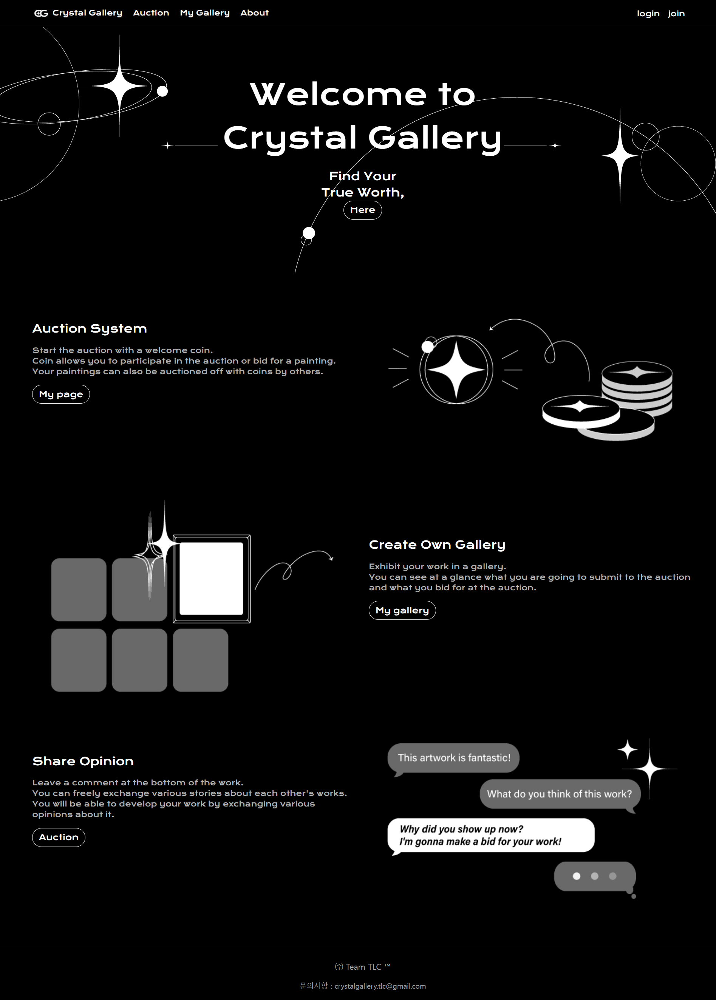
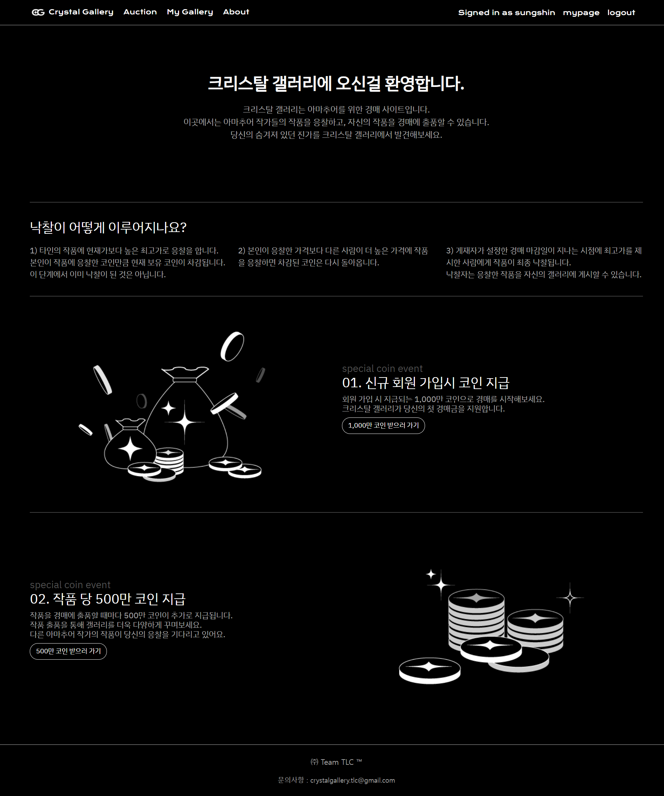
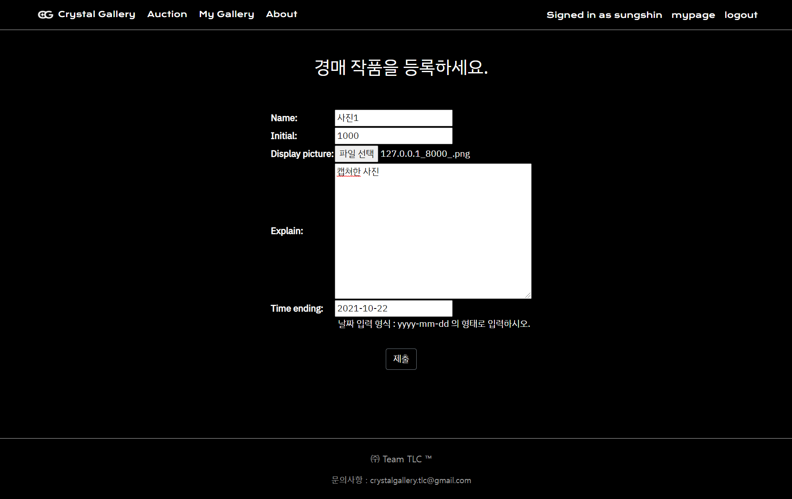
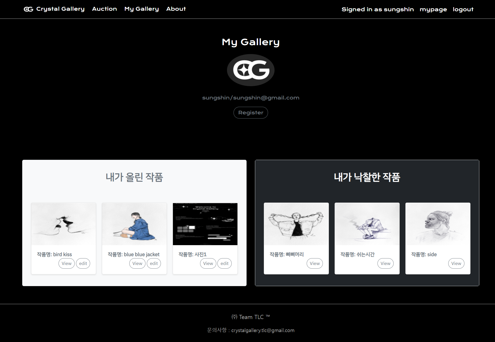
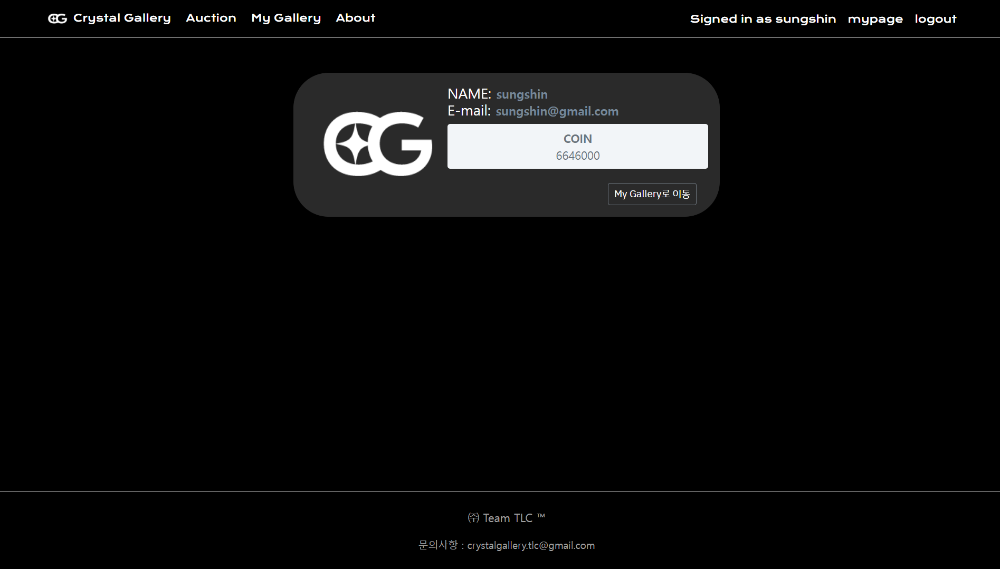
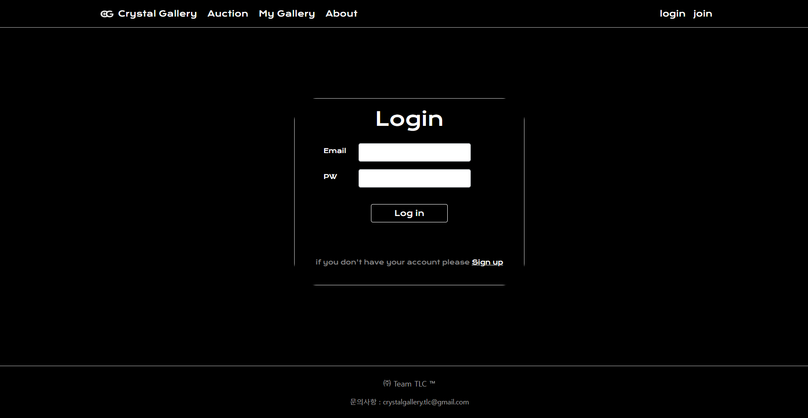
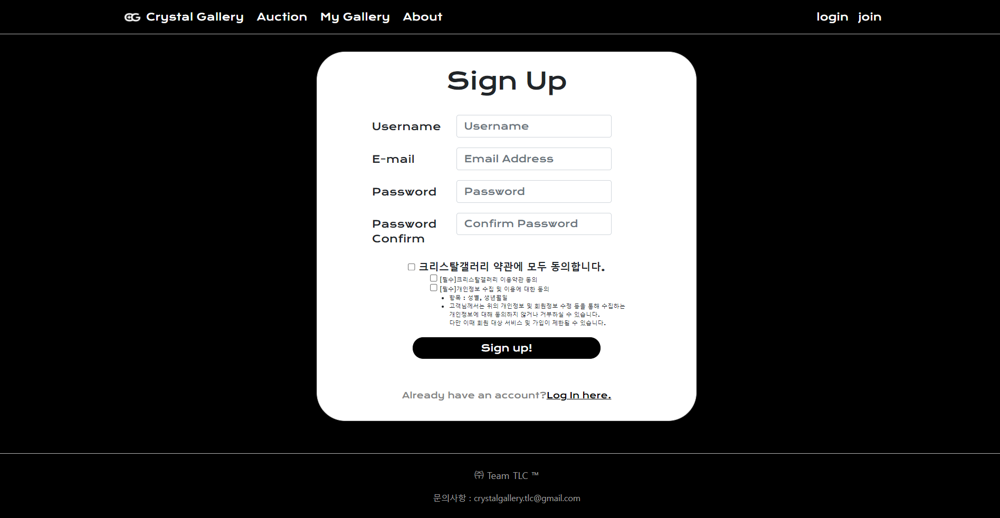

# Crystal-Gallery
TLC - 크리스탈갤러리

✔️ **목적** : 자신의 작품을 평가받을 수 있고 경매를 체험할 수 있는 웹 개발

✔️ **타겟층** : 미대를 준비하는 고등학생과 미대생, 아마추어 창작자

1. 아이디어를 평가
2. 아이디어를 경매

**[페이지 주요 기능]**

- 회원가입 ⇒ (이메일(아이디), 닉네임, 비밀번호, 비밀번호 확인, 자신의 신분을 나타낼 수 있는 옵션 창 + 추천인 기능)
- 저작권 관련 문제가 발생할 것 같음 ⇒ 저작권 관련 경고 문구를 팝업 창으로 띄운다.
    
    ㄴ 메인창, 회원가입, 경매 페이지
    
- 코인(원 단위) 지급 ⇒  회원가입 할 때, 작품 평가할 때, 본인의 작품을 올릴 때
- 프로필 ⇒ 내가 올린 글, 내가 쓴 글, 등급, 보유 잔액…
- 마이 갤러리 ⇒ 자기 작품을 올리고, 산 작품을 전시… (프로필을 눌렀을 때, 갤러리를 소개하는 페이지)
- 작품 올릴 때 ⇒ (닉네임, 작품명, 작품 설명, 경매 마감일(자동적으로 작품을 올리고 일주일), 경매 시작가(작품 올리는 사람이 결정), 경매 or 피드백 구별)
- 경매 ⇒ 금액을 폼으로 입력 받기, 옆에 최고가를 계속 띄워 주는 형식

**+ 추가적인 기능**  

- 등급 (등급에 따라 홈페이지를 사용하는 범위가 달라짐)
- 작품을 올릴 때 키워드 선택 ( + 검색 기능)

### main

### about

### auctionArts

### create

### myGallery

### myPage

### login

### signup

